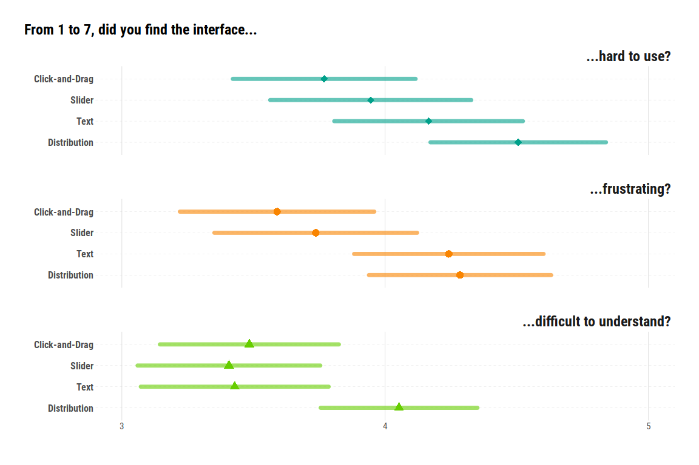

# The performance comparison paper

[Get the full paper](https://www.dropbox.com/s/d0j0sa6nkn0ybuy/Crosetto_De_Haan_Eliciting_beliefs_when_the_distribution_matters_a_horse_race_of_tools.pdf?dl=1){: .btn .btn-primary .fs-5 .mb-4 .mb-md-0 .mr-2 }

[Get the data and scripts to replicate the analysis](https://github.com/paolocrosetto/Click_and_drag_belief_elicitation_data_analysis){: .btn .fs-5 .mb-4 .mb-md-0 }

[Browse the pre-registration](https://osf.io/ft3s6){: .btn .fs-5 .mb-4 .mb-md-0 }

## Aim of the paper

We think that a belief elicitation interface should:

-   be **easy to understand**;
-   allow for **all sort of beliefs**, from simple point estimates to bimodal distributions and more, without imposing any structure;
-   manage **not to get in the way** of subjects;
-   **help subjects** easily express what they believe;
-   be **fast**, **responsive**, and **accurate**.

There are several interfaces out there. Which one is the best according to the above criteria? We ran a test to find out.

## The test

We test our newly developed Click-and-Drag interface against the state of the art in the experimental economics literature and in the online forecasting industry:

-   a text-based interface
-   multiple sliders
-   a distribution-manipulation interface similar to the one used at Metaculus

We asked 372 MTurkers to mimic a given distribution. It looks like this:

Subjects must simply try to mimic as close as possible the given target distribution. The closer they get, the more they earn.

They face screens with symmetric, asymmetric, bimodal, and complex distributions; with 7, 15 or 30 bins; and they are given 45 or 15 seconds per screen. Here are all the screens subjects had to mimic:

We also collect subjective data on ease of use, frustration and understanding.

We pre-registered the experiment (here <https://osf.io/ft3s6>), with a simple set of hypotheses: Click-and-Drag will outperform all other interfaces.

### Sample

We recruit 372 MTurkers -- on average middle-aged, mostly male, that on average fare fairly well on our control questions, and who earn between 2 and 3 euros on our 20-minute task:

<table class="table" style="margin-left: auto; margin-right: auto;">
<thead><tr>
<th style="empty-cells: hide;border-bottom:hidden;" colspan="1"></th>
<th style="border-bottom:hidden;padding-bottom:0; padding-left:3px;padding-right:3px;text-align: center; " colspan="1">
N
</th>
<th style="border-bottom:hidden;padding-bottom:0; padding-left:3px;padding-right:3px;text-align: center; " colspan="1">
% female
</th>
<th style="border-bottom:hidden;padding-bottom:0; padding-left:3px;padding-right:3px;text-align: center; " colspan="1">
mean age (sd)
</th>
<th style="border-bottom:hidden;padding-bottom:0; padding-left:3px;padding-right:3px;text-align: center; " colspan="1">
mean payoff (sd)
</th>
<th style="border-bottom:hidden;padding-bottom:0; padding-left:3px;padding-right:3px;text-align: center; " colspan="1">
% no error in CQ
</th>
</tr></thead>
<tbody>
  <tr>
   <td style="text-align:left;"> Click-and-Drag </td>
   <td style="text-align:center;"> 95 </td>
   <td style="text-align:center;"> 41% </td>
   <td style="text-align:center;"> 36.73 (9.69) </td>
   <td style="text-align:center;"> 2.92 (0.75) </td>
   <td style="text-align:center;"> 43% </td>
  </tr>
  <tr>
   <td style="text-align:left;"> Slider </td>
   <td style="text-align:center;"> 91 </td>
   <td style="text-align:center;"> 42% </td>
   <td style="text-align:center;"> 40.56 (10.93) </td>
   <td style="text-align:center;"> 2.35 (0.7) </td>
   <td style="text-align:center;"> 49% </td>
  </tr>
  <tr>
   <td style="text-align:left;"> Text </td>
   <td style="text-align:center;"> 91 </td>
   <td style="text-align:center;"> 48% </td>
   <td style="text-align:center;"> 37.07 (10.94) </td>
   <td style="text-align:center;"> 2.17 (0.89) </td>
   <td style="text-align:center;"> 46% </td>
  </tr>
  <tr>
   <td style="text-align:left;"> Distribution </td>
   <td style="text-align:center;"> 95 </td>
   <td style="text-align:center;"> 37% </td>
   <td style="text-align:center;"> 37.11 (11.17) </td>
   <td style="text-align:center;"> 2.23 (0.43) </td>
   <td style="text-align:center;"> 37% </td>
  </tr>
</tbody>
</table>

### Accuracy

The main indicator is accuracy: how good are subjects at mimicking the target distribution in the allotted time? It turns out Click-and-Drag sports the highest accuracy overall, and when breaking screens down by their type, granularity, and allotted time.

<!-- -->

### Speed

An interface is good if it allows for a good accuracy, but also if it does so in a limited amount of time. Is it easy to draw the main strokes of one's beliefs or is it a long and painful exercise? How fast do subjects converge to the best accuracy?

It turns out Click-and-Drag allows for a faster convergence than all other shapes. In this plot we draw accuracy at each point in time for each belief elicitation interface. Distribution starts with an unfair advantage, as it does not start with a blank sheet but with a normal-looking distribution; still, its slope -- the speed of convergnece -- is the lowest of them all.

<!-- -->

### Self-reported assessment

But how do subjects themselves rate the interfaces? We asked three questions about the ease of understanding, ease of use, and generated frustration.

Click-and-Drag comes on top of all self-reported assessment (even if most of the differences are not significant).

<!-- -->

### Get the paper

You can find the paper, with all the details, more results, statistical tests, and further exploration of the interfaces' performance [here](https://www.dropbox.com/s/d0j0sa6nkn0ybuy/Crosetto_De_Haan_Eliciting_beliefs_when_the_distribution_matters_a_horse_race_of_tools.pdf?dl=1.)

### Get the software

Find the oTree code for each of the four interfaces [here](https://github.com/beliefelicitation/otree-elicitation-tool) 

Try it out yourself on our oTree demo [here](https://beliefelicitation.herokuapp.com/demo)
